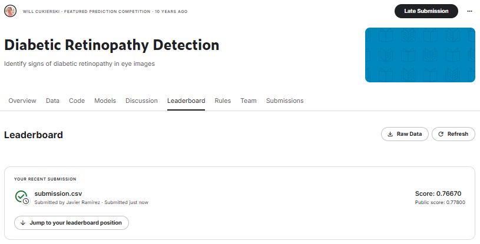
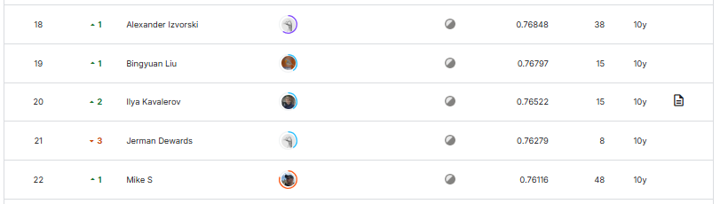
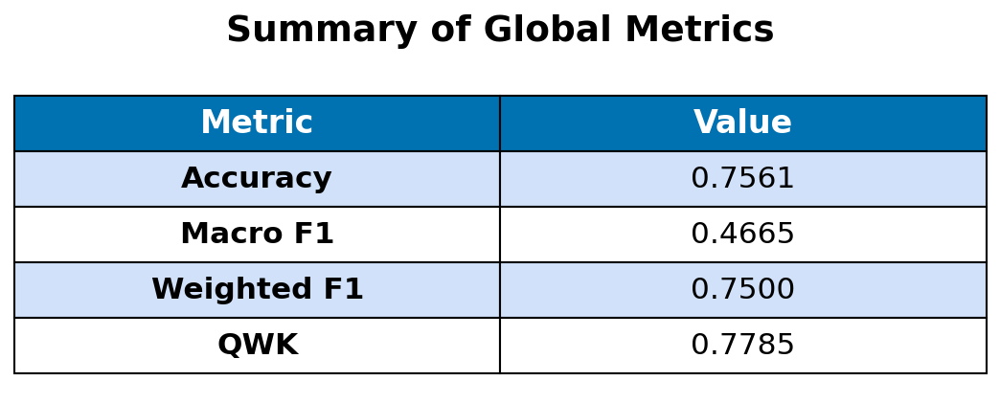
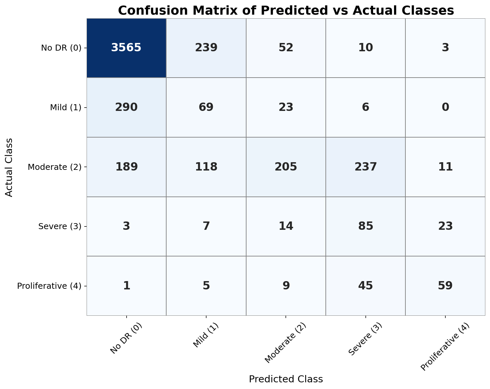
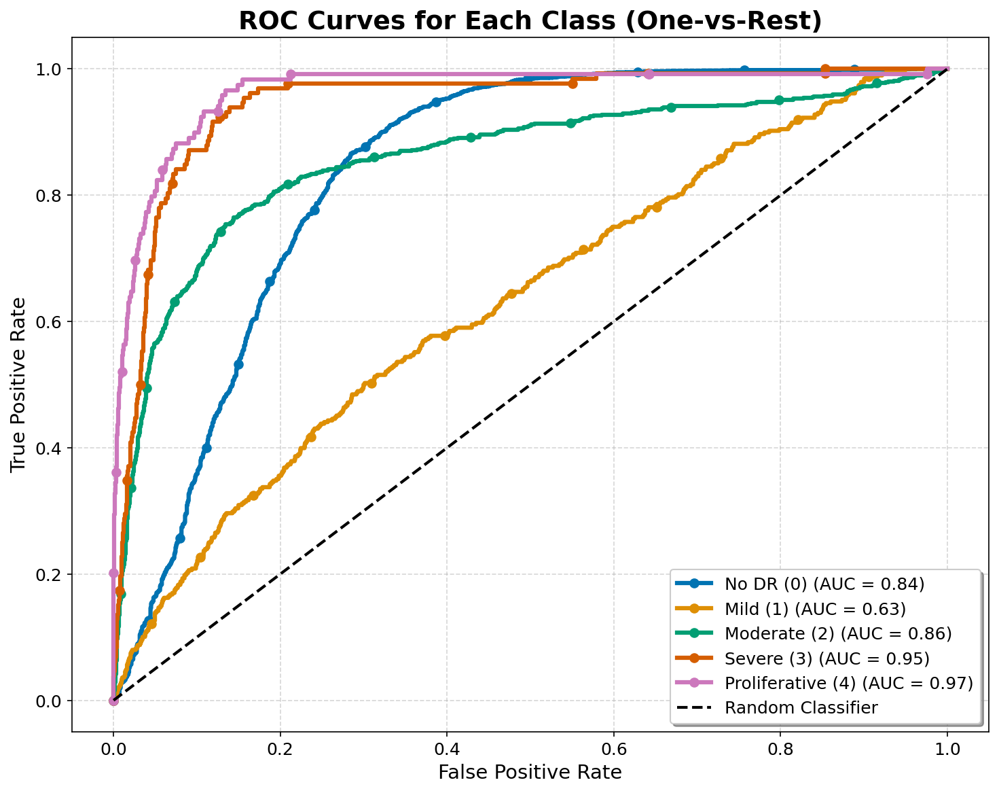

# 👁️ Battling Blindness | Automated Diabetic Retinopathy Detection using Multi-Stage Deep Learning

This project delivers a robust, end-to-end deep learning system for the automated detection and severity classification of Diabetic Retinopathy (DR) from retinal images. It features an advanced two-stage architectural approach, utilizing EfficientNet for individual eye feature extraction, followed by a specialized neural network that processes and combines information from both eyes. The aim is to provide a clinically viable and scalable solution to accelerate diagnosis and significantly contribute to preventing vision loss worldwide.

---

## Table of Contents

- [1. Problem Context](#1-problem-context)
- [2. The Dataset](#2-the-dataset)
- [3. Model Architecture](#3-model-architecture)
- [4. Evaluation and Training Strategy](#4-evaluation-and-training-strategy)
- [5. Results](#5-results)
- [6. Repository Structure](#6-repository-structure)
- [7. How to Replicate the Project](#7-how-to-replicate-the-project)
- [8. License](#license)

---

## 1. Problem Context

Diabetic Retinopathy (DR) is a leading cause of blindness globally, affecting millions of individuals with diabetes. Early detection is crucial to prevent disease progression and irreversible vision loss. Currently, diagnosis is a time-consuming and manual process, relying on expert evaluation of retinal images. This project aims to automate and expedite this process, enabling earlier and more accessible detection, particularly in resource-limited regions where ophthalmic specialists may be scarce.

---

## 2. The Dataset

This project was developed for the Kaggle competition ["Diabetic Retinopathy Detection"](https://www.kaggle.com/competitions/diabetic-retinopathy-detection). The dataset comprises a large collection of high-resolution retinal images, graded by a clinician on a scale from 0 to 4:

- **0 - No DR:** No Diabetic Retinopathy.
- **1 - Mild:** Mild Diabetic Retinopathy.
- **2 - Moderate:** Moderate Diabetic Retinopathy.
- **3 - Severe:** Severe Diabetic Retinopathy.
- **4 - Proliferative DR:** Proliferative Diabetic Retinopathy (the most advanced and severe stage).

The images exhibit real-world variations in camera models and lighting conditions, necessitating a robust and adaptive model.
---

## 3. Model Architecture

To address the challenge of Diabetic Retinopathy (DR) classification, I implemented a two-stage deep learning solution.

The core of this approach lies in using two distinct models. The first is an EfficientNet-B3 model, pre-trained on ImageNet, which acts as a powerful feature extractor. This model processes individual eye images to generate rich, discriminative feature maps (embeddings). Rather than direct classification, once the model is trained, its final layers are removed, allowing it to generate these features.

Subsequently, a simple Feed-Forward Neural Network forms the second stage. This network takes the concatenated feature vectors from both the patient's left and right eyes as input. It then learns to combine this bilateral information, leveraging the inherent relationship between the condition of a patient's two eyes, to generate two final prediction scores, one for each eye's DR severity level.

---

## 4. Evaluation and Training Strategy

The primary performance metric for this competition is the Quadratic Weighted Kappa (QWK). QWK measures the agreement between predicted and true ratings, applying a higher penalty for larger misclassifications.

Although QWK was the evaluation metric, the models were trained using Mean Squared Error (MSE) loss. This choice was crucial because DR severity is an ordinal variable. MSE naturally penalizes larger prediction errors more severely than smaller ones (due to the squared difference). This implicitly encourages the model to respect the ordinal scale and minimize significant misclassifications, aligning with the quadratic penalty of the QWK metric.

Since the models generate continuous regression scores, a final threshold optimization step was applied. This process finds the optimal cut-off points on the validation set's raw predictions to convert them into the discrete DR severity levels (0-4), directly maximizing the QWK.

---

## 5. Results

This project not only offers an innovative solution for detecting diabetic retinopathy, but it also demonstrated exceptional performance in the Kaggle competition **"Diabetic Retinopathy Detection"**. Ranking **20rd out of 661 participants**, this model placed in the **top 3%** of the competition, showcasing its effectiveness and robustness in a real-world, competitive data environment.

> **Note:** Since the Kaggle competition is now closed, the submission does not appear on the official leaderboard. However, based on the final private leaderboard scores, this solution would have ranked 20th out of 661 participants.

To evaluate the model's performance, several key metrics were used, with **Quadratic Weighted Kappa (QWK)** being the primary metric of the competition due to its relevance for the classification.

The achieved **QWK score of 0.7694** indicates a high level of agreement between the model's predictions and expert labels. While the **accuracy** stands at **77.47%**, it is important to note that this metric can be misleading in this context due to the severe class imbalance, particularly the predominance of the "No DR" category. Therefore, the **weighted F1-score of 0.7536** provides a more meaningful representation of the model’s ability to handle class imbalance, which is a common challenge in medical datasets. This highlights the model’s robustness across most categories.

These results—reinforced by the competition ranking and the detailed analysis of metrics and visualizations—confirm the effectiveness of the proposed solution and its promising potential to assist in the early and accurate diagnosis of diabetic retinopathy.

---

## 6. Repository Structure

This repository is organized to provide a clear and efficient workflow for the Diabetic Retinopathy Detection project. Below is a brief overview of the main directories and files:

- `main.py`: The main script to run the entire training and submission process.
- `config.py`: Centralized configuration settings (paths, hyperparameters, etc.).
- `datasets.py`: Custom PyTorch Dataset classes for data loading and preprocessing.
- `training_utils.py`: Utility functions for model training (e.g., `train_epoch`, `save_checkpoint`).
- `evaluating_utils.py`: Utility functions for model evaluation (e.g., `get_metrics`, `optimize_prediction_thresholds`).
- `twoeyesmodel_and_utils.py`: The Two-Eye Combination Model and functions for extracting and combining features from individual eyes.
- `visualization_utils.py`: Utility functions for creating plots and visualizations.
- `train_val_split.py`: Utility functions for splitting the dataset into training and validation sets.
- `results_figures/`: Stores generated plots, charts, and visual outputs from model training and evaluation.

---

## 7. How to Replicate the Project

You can easily replicate and run this project by editing and executing the provided Kaggle Notebook. This notebook has all the necessary Python files (`.py`) consolidated within it, alongside access to the dataset, significantly simplifying the setup process.

Here's how to get started:

1.  **Access the Kaggle Notebook:**
    Navigate to the project's dedicated Kaggle Notebook here: **["My Kaggle Notebook"](https://www.kaggle.com/code/jramirez14/diabetic-retinopahty-detection)**

2.  **Copy and Edit the Notebook:**
    Once on the Kaggle Notebook page, click on "Copy & Edit" to create your own editable version.

3.  **Enable GPU Accelerator:**
    For optimal training performance and to leverage the power of deep learning, it's **crucial to enable the GPU accelerator**. In your copied Kaggle Notebook, go to the right-hand sidebar, click on "Accelerator," and select "GPU."

4.  **Run All Cells:**
    With the GPU enabled, you can now run all cells in the notebook. This will execute the data loading, model training (EfficientNet and the Two-Eye Combination Model), evaluation, and finally generate the submission file.

> **Note:** A pre-trained EfficientNet model is already provided as a Kaggle Dataset input. If you set the number of EfficientNet training epochs to `0`, the script will skip training and automatically load the pre-trained model instead. This allows you to directly proceed with feature extraction and further evaluation or fine-tuning.

This streamlined approach on Kaggle allows for quick setup and execution, letting you focus on understanding and experimenting with the model.

---

## License

This project is licensed under the [MIT License](LICENSE).

